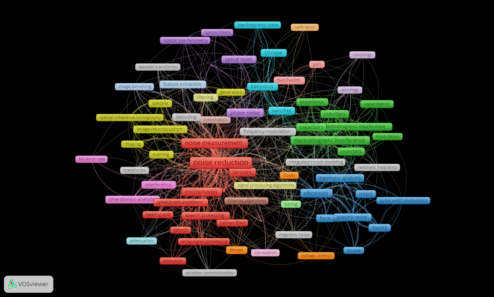
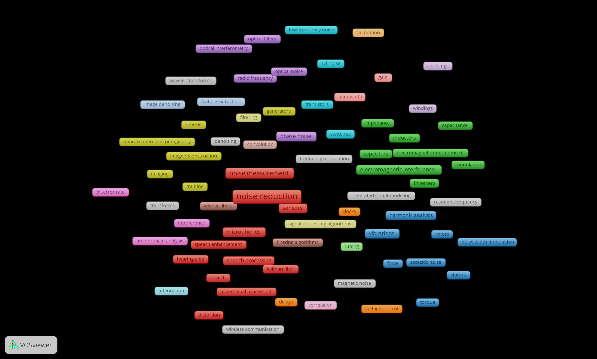
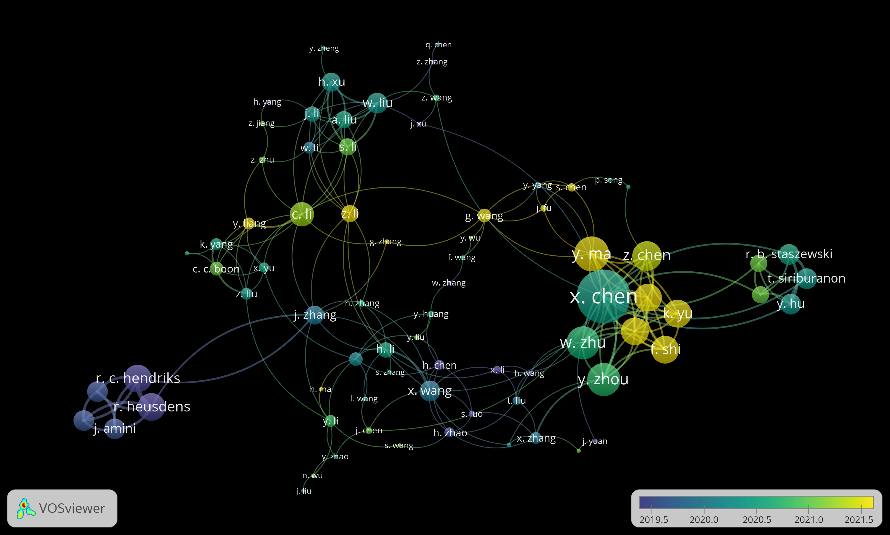
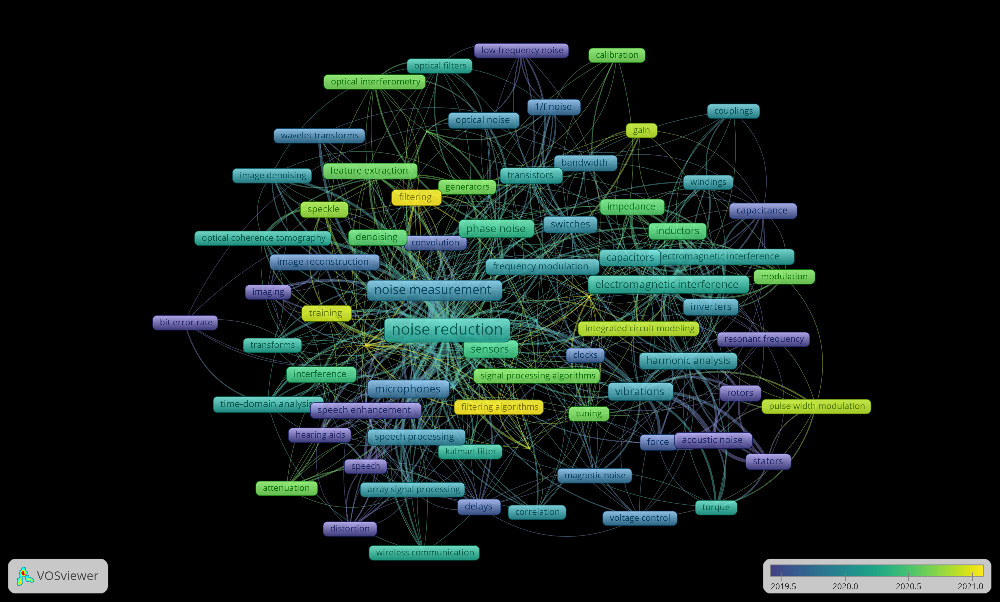
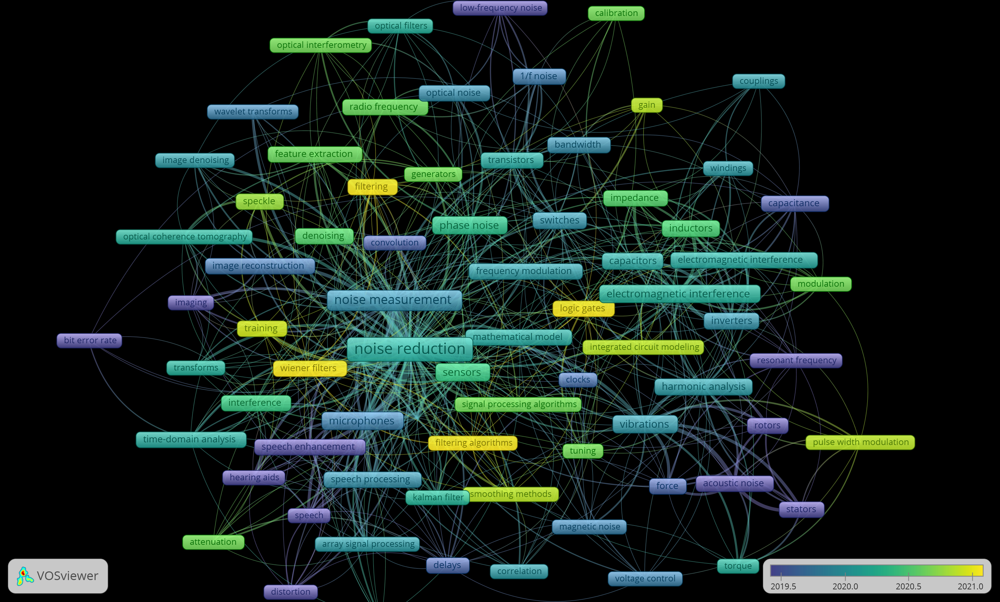

# 1. TRABALHO DE CONCLUSÃO DE CURSO UNITINS
ORIENTADOR: Prof. Me. Marco Antonio Firmino De Sousa
ALUNO: Tales Monteiro Melquiades

## 1.1. Entrega

- [ ] Introdução
- [X] Objetivos e Escopo de Pesquisa
- [X] Escopo de Pesquisa
- [X] Justificativas
- [ ] Revisão bibliométrica
- [ ] Trabalhos Relacionados
- [ ] Metodologia
- [ ] Resultados
- [ ] Conclusão


## 1.2. Introdução


## 1.3. Objetivos e Escopo de Pesquisa

### 1.3.1. Objetivos
```OKR 
Eu vou **desenvolver uma biblioteca c** para ser usada em qualquer RTOS, no auxiliar da **filtragem de dados** ruidosos ou discrepantes coletada de sensores. 
```
Visto a exorbitante quantidade de dados provindo de sensores, somando a incerteza da qualidade de fabricação dos componentes eletrônicos de baixo custo disponíveis em ampla quantidade no mercado, torna o desenvolvimento para sistemas criticos que dependem da veracidade dos valores provindos dos sensores, ambiente assíncrono com múltiplas tarefas em simultâneo, complexos e custosos para as equipes de engenheiros de software, que utilizam de tempo para garantir a integridade e veracidades de todos os valores. 

Com isso em mente o trabalho aqui proposto se dispõem de construir uma biblioteca de código aberto, que disponibilizara funções adequadas para a filtragem de dados provindo de sensores em ambiente de tempo real com multitarefas, testando a coleta e filtragem de dados no processador dual core ESP32 no sistema operacional de tempo real Zephyr.

#### 1.3.1.1. Objetivos Secundários
- Desenvolver uma biblioteca c de filtragem de dados

- Escrever código amigável a utilização em Sistemas Operacionais de Tempo Real

- Realizar uma revisão bibliométrica de trabalhos que utilizam de métodos probabilísticos para filtragem de dados de sensores   

- Disponibilizar o código de forma aberta a comunidade, para que possa ser utilizado por qualquer outro interessado em tratar dados de sensores em ambiente de multitarefas

- Escrever funções de filtragem utilizando os métodos de **Desvio padrão** e **Intervalo de confiança**

#### 1.3.1.2. Escopo de Pesquisa

O escopo desta pesquisa abrange um conjunto de funções escritas na linguagem C para a filtragem de dados indesejáveis vindos de sensores diversos, funções quais... , tento como característica atuar de forma amigável junto a um sistema operacional de tempo real. Assim, em um primeiro momento considerou-se desenvolver e testar a biblioteca sobre o Chip ESP32 da fabricante Espressif e em conjunto com o sistema operacional Zephyr um projeto mantido pela Fundação Linux.  

## 1.4. Justificativa

Dados provindos do mundo real são constantemente contaminados com ruídos ou podem não corresponder a realidade, esse tipo de situação pode afetar perigosamente um programa de computador qualquer que lida com dados de sensores. Muitos programas podem depender que essa resposta deva ser rápida o suficiente para não comprometer o desempenho e a segurança do programa, um veiculo automato ou um equipamento medico por exemplo não podem trabalhar com dados incorretos, mesmo que sejam em curtos períodos de tempo, os mesmos dependem que a resposta vinda dos sensores sejam rápidas e verdadeiras, com as respostas discrepantes sendo descartadas não comprometendo sua missão. Assim então este trabalho visa contribuir com a construção de uma biblioteca na linguagem C é de código aberto, onde será oferecido funções para tratamento de dados ruidosos advindos do mundo real, cuidando de se preocupar em trabalhar em conjunto com o RTOS Zephyr, economizando tempo de desenvolvimento e centralizando código aberto para todo e qualquer projetista de software interessado em consumir e contribuir ao projeto.

## 1.5. Trabalhos Relacionados
```` Revisar essa introdução!! ````

Aqui será dedicado a descrever os trabalhos relacionados, descrevendo cada um dos estudos e abordando seus pontos fortes e fracos.

O autor (ZHUANG et al., 2007) <!-- \cite{International_Conference__Zhuang} --> propõem uma abordagem de limpeza de dados de sensores, com um algoritmo de média móvel ponderada inteligente que coleta dados já validados e realiza com eles um calculo de média móvel ponderada, comparando a mesma com o calculo de média móvel. Em (NARKHEDE; DESHPANDE; WALAMBE, 2019)<!-- \cite{particle_swarm__Narkhede} --> o artigo apresenta um novo procedimento para a limpeza de dados ruídosos advinda de sensores, utilizando uma técnica de otimização de enxame de partículas demonstrando a viabilização do algoritmo. No livro (ELNAHRAWY; NATH, 2003) <!-- \cite{Statistical_approach__Elnahrawy} -->


## 1.6. Revisão Bibliométrica

<!-- TODO: Inserir descrição de alguns artigos encontrados -->

Nesta seção são consideraras as informações referentes á produção acadêmica mundial, que abordam os termos em ingles Noise reduction, noise abatement, Filtering algorithm e Sensor, significando em sequencia redução de ruído, algoritmos de filtragem e sensores. 

Ambos os tópicos foram pesquisados na base IEEE Xplore, com a busca limitada aos termos noise reduction e noise abatement no titulo do documento e filtering algorithm, sensor e noise reduction apenas no texto completo, delimitando exclusivamente aos artigos de 2018 a 2022. Resultando em 675 resultados sendo eles 450 conferencias, 215 artigos, 8 artigos com acesso  antecipado e 2 revistas, foi realizado uma revisão bibliométrica sobre estes 215 artigos resultantes. 

Dados provenientes de sensores são constantemente bombardeados com interferências aleatórias do ambiente onde se encontram, também devido a baixa qualidade provenientes dos sensores de baixo custo disponíveis, inserindo valores incorretos que são caracterizados como ruídos nas amostras. Esse problema desperta um grande interesse de pesquisadores, que buscam lidar com o tratamento e a filtragem de dados ruídosos provindos de sensores diversos, o artigo \cite{chiang_noise_reduction_in_ECG} se destaca por ser o trabalho mais citado nessa pesquisa bibliométrica, o mesmo aborda o problema da interferência de ruídos nos sinais provindos dos sensores de eletrocardiograma, esses dados podem ser contaminados por fatores como a estática da pele ou mesmo pela respiração do paciente, para isso técnicas como wavelet são muito populares, utilizadas para filtrar dados cancelando o ruído analisando mudanças bruscas ou picos na frequência do sinal, o método de decomposição do modo empírico também e bastante utilizado, definindo fronteiras entre o local máximo e mínimo de uma subtração de sequencia que consequentemente ajudam na triagem do tratamento do sinal.   

...

A Figura ... representa um mapa de visualização de rede, onde podemos visualizar os termos mais predominantes. Aqui são percebidos o termos que se repetiram mais de 5 vezes nos textos e resumos, nota-se a formação de grupos de acordo com suas áreas de atuação, alguns termos em destaque são em azul relacionados a motores, vibrações e forças mecânicas, os em verdes referentes a componentes eletrônicos, roxo a sensores ópticos, amarelo o tratamento de imagem e em vermelho sensores embarcados e processamento de sinais. 


<!--  -->

Todos essas expressões aprofundam a problemática no qual tratamento de ruídos, algoritmos de filtragem e sensores estão correlacionados, indo de problemas em programas de computador a desenvolvimento de circuitos eletrônicos e peças mecânicas. O error na fabricação de sensores ópticos pode levar a fenômenos de interferência nos resultados \cite{liu_interference_stripe}, essas anomalias prejudicam sistemas de medição holográfica digital, afim de melhorar a captação de imagens sem ruído o autor propõem um novo método de processamento de imagem utilizando pirâmide laplaciana para destacar o ruído de faixa de interferência.
Em \cite{duarte_speckle_noise} afim de melhorar aplicações biomédicas em imagens de ultrassom, o trabalho descreveu 27 técnicas para tratamento eliminação de ruido em em imagens de ultra-som, essas imagens são de verdadeira importância para o diagnóstico clínico e procedimentos terapêuticos não invasivos, fundamentais em diversas áreas da saudê.




A figura ... apresenta um mapa semelhante a figura anterior, onde podemos notar os autores mais citados destacando-os pelo tamanho e sua presença media em artigos mais recentes marcado pela cor mais amarela.

Na Figura .. abaixo podemos visualizar um mapa de sobreposição, onde os vocabulários mais amarelos representam os que se encontram em publicações em media mais recentes, também podemos notar a relação entre as palavras encontradas em todos os títulos e resumos. 


<!--  -->

Há de se notar que os termos filtragem e algoritmos de filtragem se destacam pela sua quantidade acima da media de trabalhos mais recentes, não se distanciando das definições de redução de ruído, sensores e algoritmos de processamento de sinais próximos do centro do mapa.

#### Conclusões sobre a Revisão Bibliométrica realizada
Percebesse que o estudo na área de tratamento de dados de sensores concentra-se em média uma grande quantidade de trabalhos recentes, com diferentes abordagens de como remover ou reduzir dados ruidosos, apresentando a ideia de que o tema e de interesse atual da comunidade acadêmica mundial. A diversos ramos nos quais tratamento e eliminação de ruídos de sensores podem peregrinar, podendo verificar a ocorrência dos termos em problemas que não necessariamente estão interessados na obtenção do sinal limpo, mas sim na caracterização e coleta dos ruídos na amostra ou que fogem do escopo deste trabalho com a eliminação de ruído, sendo feita através de equipamento físico.

## 1.7. Metodologia

### Tabela de referencias

Aqui serão apresentados os 5 artigos recentes do ano de 2022 relacionados a esse trabalho, tendo suas vantagens e desvantagens levantadas com relação aos seus métodos propostos e uma breve descrição do trabalho.

| Referência              | Vantagem                                                                           | Desvantagem                                                                                                                         | Descrição                                                                                                                                                                                                                                     |
| ----------------------- | ---------------------------------------------------------------------------------- | ----------------------------------------------------------------------------------------------------------------------------------- | --------------------------------------------------------------------------------------------------------------------------------------------------------------------------------------------------------------------------------------------- |
| \cite{Arab_LSTM_ResNet} | Algoritmo pode ser treinado em tempo real e acompanhar diferentes tipos de ruídos. | Necessita de uma grande quantidade de dados já coletados para treinamento, exigência de grande capacidade de recurso de computação. | O trabalho propõe utilizar uma técnica de aprendizado profundo para classificar e eliminar ruídos de sistemas de comunicação via micro-ondas, aproveitando-se da aptidão do algorítimo em se adestrasse com os dados coletados em tempo real. |
| \cite{}                 |                                                                                    |                                                                                                                                     |                                                                                                                                                                                                                                               |
|                         |                                                                                    |                                                                                                                                     |                                                                                                                                                                                                                                               |


## 1.8. Resultados


## 1.9. Conclusão

